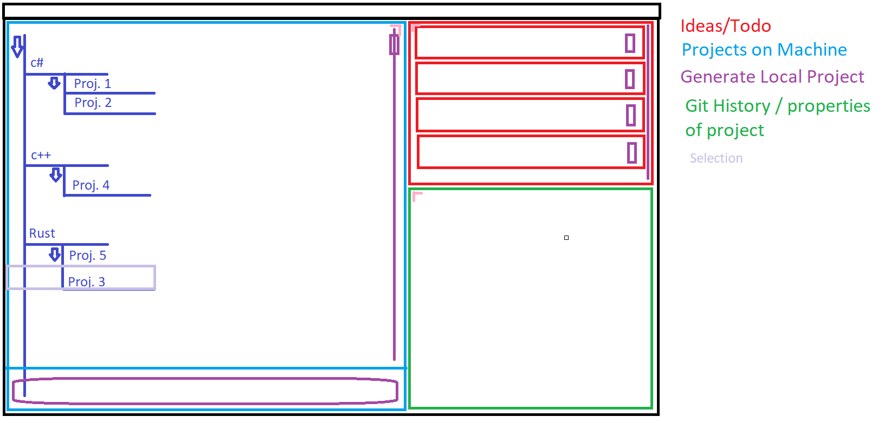

# Sphinx
-------
Sphinx is a programming projectmanagment software writen in rust and the successor to the discontinued Wetstone-client.

### Features
- Integrated git client (planed)
- Quick project setup (planed)
- Todo / Idea tracking (planed)

### Requirements
- Sphinx expects the local folder structure in this format root>language>category>project
    - so for sphinx it would be root>Rust>Project_Manager>Sphinx

### How it looks

### Todo:
Dies on big repos