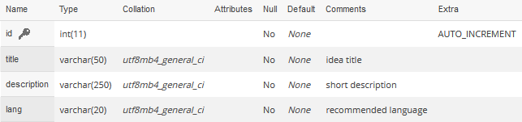
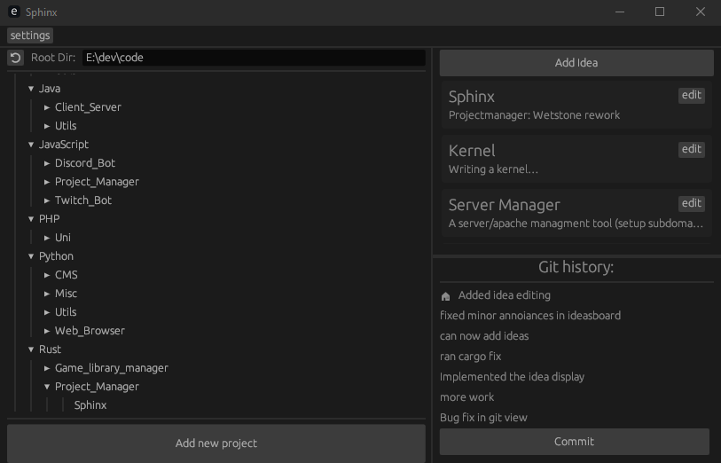

# Sphinx
-------
Sphinx is a programming projectmanagment software writen in rust and the successor to the discontinued Wetstone client.

> Current Version: 1.0.0 

### Features
- Integrated git history viewer (still a bit unstable)
- Quick project setup 
	- Supports Rust and empty projects (more to come)
- Todo / Idea tracking (Optional)

### Requirements
- Sphinx expects the local folder structure in this format ```root>language>category>project```
    - so for sphinx it would be ```root>Rust>Project_Manager>Sphinx```

- For Idea tracking a Database in the [following layout](./scripts/setup_db.sql) is required 
>(this might change in future versions)


- To run projects Sphinx expects a ["start.bat"](./scripts/start_script.bat) script in the project folder

### How it looks


### Known flaws:
- git history viewer hangs on opening large uninitialized Repositories